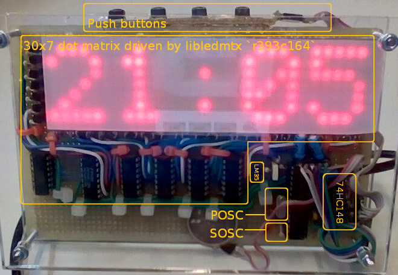

# p18clock: a PIC18-based alarm clock

## Introduction
p18clock is an alarm clock based on a PIC18F2550 microcontroller.
The project leverages the [libledmtx](https://github.com/jalopezg-git/libledmtx/) library to drive a LED dot matrix display.

p18clock includes the following features:
- Time and date function
- Display temperature in degrees Celsius
- 24h alarm
- AUTO: display current time, but start a vertical scroll showing additional lines (day-of-the-week, day-of-the-month and month, temperature) every five minutes.

[p18clock-unsharp.mp4](https://github.com/user-attachments/assets/c53c3382-a4fd-4352-af9d-7081afe7f925)

The clock is based on a finite state machine that is described in the following diagram.
It has four push buttons: MODE, SET, UP, DOWN.  MODE triggers the transition between main states.  SET can be used to cycle across sub-states.  UP/DOWN can be used to change the value for a setting.
For more information, see the [p18clock user manual](https://github.com/jalopezg-git/p18clock/blob/master/user-manual/INDEX-EN.md).

```
                                             B_MODE
        ,-----------------------------------------------------------------------------------.
       v                                                                                    `|
 +------------+        +------------+        +------------+        +-------------+        +------------+
 | STATE_TIME | -----> | STATE_DATE | -----> | STATE_TEMP | -----> | STATE_ALARM | -----> | STATE_AUTO |
 +------------+ B_MODE +------------+ B_MODE +------------+ B_MODE +-------------+ B_MODE +------------+
    |       ^             |       ^             |      ^              |        ^
    | B_SET  \            | B_SET  \            | B_SET \             | B_SET  |
    v         `           v         `           v        `            v         `
 +----------+  `       +----------+  `       +---------+  `        +----------+  `
 | _SETHOUR |  |       | _SETMDAY |  |       | _SETVDD |  |        | _SETHOUR |  |
 +----------+  |       +----------+  |       +---------+  |        +----------+  |
    | B_SET    |          | B_SET    |          | B_SET   |           | B_SET    |
    v          |          v          |          v         |           v          |
 +----------+  ,       +----------+  |       +---------+  ,        +----------+  ,
 | _SETMIN  |--        | _SETMON  |  |       | _SETOFF |--         | _SETMIN  |--
 +----------+          +----------+  |       +---------+           +----------+
                          | B_SET    |
                          v          |
                       +----------+  ,
                       | _SETYEAR |--
                       +----------+

STATE_TIME: Display current time		STATE_DATE: Display current date
STATE_TEMP: Display temperature			STATE_ALARM: Display scheduled alarm
STATE_AUTO: Auto-cycle display modes above

_SETHOUR: Set current time - hour		_SETMIN: Set current time - minutes

_SETMDAY: Set current date - day		_SETMON: Set current date - month
_SETYEAR: Set current date - year

_SETVDD: Manually set VDD (if HLVD fails)	_SETOFF: Set temperature offset, e.g. to compensate
	 	      	     	  	  	         for a specific physical location

_ALARM_SETHOUR: Set alarm time - hour		_ALARM_SETMIN: Set alarm time - minutes
```

## Compiling
In addition to [sdcc](https://sdcc.sourceforge.net/), p18clock requires a libledmtx installation in the `$HOME/.local/libledmtx/` directory:
```bash
$ git clone --depth=1 https://github.com/jalopezg-git/libledmtx/
$ cd libledmtx/
$ make
$ make INSTALL_PREFIX=$HOME/.local/libledmtx/ install
$ cd ../
```

Afterwards, p18clock can be built as follows:
```bash
$ # Generate `p18clock.hex`; the image can be flashed into the MCU via pk2cmd
$ make P18CLOCK_LANG=EN # or `P18CLOCK_LANG=ES` to use Spanish translation
```

Additional arguments can be passed to `make` in order to enable/disable specific features; specifically,
- `LARGE_DISPLAY=1`: build for latest p18clock hardware (builtin 40x8 display); if not defined, build targets a 32x7 display.
- `REVERSE_PUSHB_ORDER=1`: define if the PCB has push buttons laid out in reverse order.
- `P18F2550=1`: define to target the PIC18F2550 MCU (still in the original prototype).

## Hardware


For the KiCAD project see [here](https://github.com/jalopezg-git/p18clock/tree/master/hardware/kicad/), which includes both the latest circuit schematic and the PCB layout.
The display is made up of five 8x8 KYX-1088B parts where row pins have been physically connected, thus resulting in a 40x8 LED matrix.
For more details, refer to the libledmtx [hardware description](https://github.com/jalopezg-git/libledmtx/#hardware).

Push buttons are wired to a 74HC148 binary encoder whose output is connected to RB<1:3>; this makes it possible to have up to 7 push buttons using few I/O pins.
A change on a PORTB pin triggers a INT0 interrupt.
The INT0 handler places the corresponding message in a circular buffer, that is to be dispatched from the main loop.

100 nF decoupling capacitors are placed near the Vdd lines of the microcontroller, together with two 4.7 uF "bulk" capacitors placed near the power lines on the board.

The secondary oscillator used as a RTC is a 32.768 kHz crystal.
Temperature measuring is based on the well-known LM35 temperature sensor.
