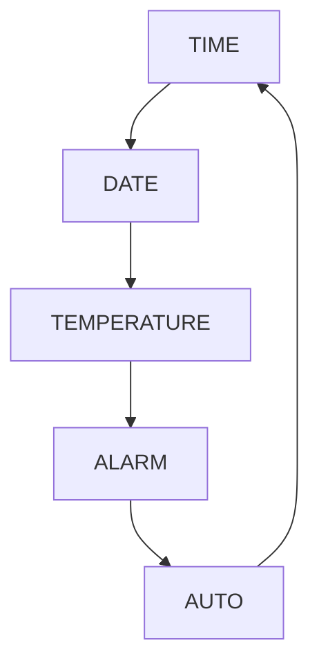

# p18clock user manual
p18clock exposes four control switches.  Specifically,
- `MODE`: alternates between different display modes.
- `SET`: enter 'assign' mode / accept value.
- `UP`: increment value having input focus / increase brightness.
- `DOWN`: decrement value having input focus / decrease brightness.

> [!TIP]
> Note that buttons may be pressed and held, which after some delay will simulate repeated switch presses.

## p18clock booting
During boot, p18clock will produce a short beep and will display the firmware version and the underlying libledmtx build in use.  It then enters [Time setting mode](#time-setting-mode).

## Display modes
p18clock features five different display modes: TIME, DATE, TEMPERATURE, ALARM, and AUTO.  While being in any of these modes, the `MODE` switch can be used to cycle between the different states.

> [!NOTE]
> `UP` / `DOWN` can be used, respectively, to increase / decrease display brightness :level_slider: in any of the five display modes.  Eight brightness levels are available.
> Input current varies with the brightness level (see [Electrical characteristics](#electrical-characteristics) for details).  The brightness level is not remembered across reboots.

### TIME
No distractions -- this mode continuously displays the current time.  If an alarm is set, a small indicator is shown on the right.
To enter time setting mode, press `SET`.

#### Time setting mode
Use `UP` / `DOWN` to choose a value for the hour; then, press `SET` to move focus to the minutes.  Use `UP` / `DOWN` again to choose a value for the minutes.  Finally, press `SET` to return to the TIME display mode.

### DATE
This mode alternates between different parts of the date (day of the week, day of the month, month, year).  To enter date setting mode, press `SET`.

Staying in this mode for a while may be a bit annoying, and it is expected to be improved in the future.

#### Date setting mode
Use `UP` / `DOWN` to choose the month; press `SET` to confirm the selection.  Use `UP` / `DOWN` to set the current year; then, press `SET`.  Finally, use `UP` / `DOWN` to choose the day of the month.  The day of the week is automatically detected.  Press `SET` again to make the changes effective.

### TEMPERATURE
This mode displays the current room temperature, sampled every 20 seconds.  Temperature range is 0--100 degrees Celsius.

### ALARM
Alarm time is displayed in this mode (or `--:--` if alarm is not set).
To set an alarm :bell:, press the `SET` button; then use `UP` / `DOWN` to choose the hour.  Press `SET` to move input focus to the minutes.  Use `UP` / `DOWN` again to set the minutes, and push `SET` to fix the alarm time.
The 'alarm-enabled' indicator shall be shown in the TIME and AUTO display modes.

#### Acknowledging / Cancelling an alarm
When the alarm is activated, it can be acknowledged by pressing any of the buttons.  Acknowledging the alarm effectively leaves it disabled again (`--:--`).

If an alarm is set, it can be cancelled :no_bell: at any time from the ALARM mode by pushing `SET`, then `MODE`.  The display will show `--:--`.

### AUTO
This mode shows the current time by default and, every five minutes, it starts a vertical scroll to expose additional lines: day of the week, day (of the month) and month, and temperature.
This vertical scroll happens twice and is then rescheduled to happen again after five minutes.  It can also be forced at any time by pressing `SET`.  If `SET` is held, it will temporarily trigger faster scrolling.

## Advanced aspects

### LM35 temperature sensor read calibration
The LM35 sensor output signal usually increases by 10mV per Celsius degree.  This analog signal is then fed to one Analog-to-Digital Converter (ADC) in the MCU.
Because the reference voltage for signal conversion (Vref) matches the input voltage (Vcc), Vcc has to be reliably determined for accurate temperature measurement.  This should happen automatically during boot.

However, in the event that you are experiencing unreliable temperature sampling, a couple of manual adjustments are accessible from the TEMPERATURE display mode by pressing `SET`:
- (V)oltage: this enables override of the auto-detected input voltage.
- (of)fset: a linear offset to apply to the measured temperature before displaying it (defaults to 0).  For instance, a value of -2 will internally subtract two degrees w.r.t. the actual measurement.

### Notifying bugs
If you think that p18clock does not behave as expected or that it has a clear software defect, feel free to create an issue [here](../../../issues/).

### Electrical characteristics
|                       | Value                                         |
| --------------------- | --------------------------------------------- |
| Input voltage         | DC 3.1v -- 5v                                 |
| Average input current | ~30mA (lowest brightness) -- ~340mA (highest) |
