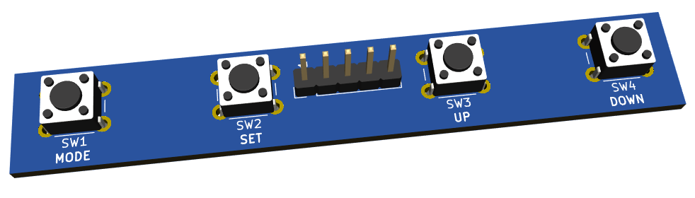
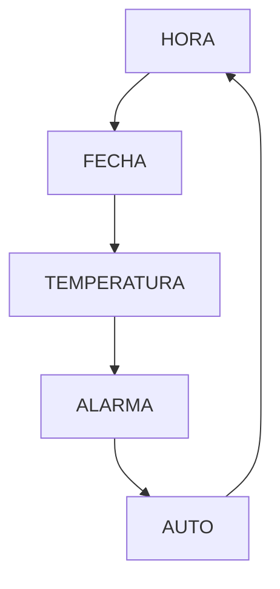

# Manual de usuario de p18clock
p18clock cuenta con cuatro botones de control.  Específicamente,
- `MODE`: alterna entre diferentes modos de visualización.
- `SET`: entra en modo 'asignación' / acepta un valor.
- `UP`: incrementar valor / incrementa el brillo.
- `DOWN`: decrementar valor / incrementa el brillo.

> [!TIP]
> Nótese que los botones pueden ser presionados y mantenidos, lo que después de un retardo simulará presiones repetidas.

## Arranque de p18clock
Durante el arranque, p18clock producirá un bip corto y mostrará la versión de firmware y la compilación de libledmtx subyacente.  Después, entra en [Modo de fijación de hora](#modo-de-fijacion-de-hora).

## Modos de visualización
p18clock tiene cinco modos de visualización diferentes: HORA, FECHA, TEMPERATURA, ALARMA, y AUTO.  Mientras se está en cualquiera de estos modos, el botón `MODE` puede usarse para cambiar entre los diferentes estados.

> [!NOTE]
> `UP` / `DOWN` pueden usarse, respectivamente, para incrementar / decrementar el brillo de la pantalla :level_slider: desde cualquiera de los cinco modos de visualización.  Hay disponibles ocho niveles de brillo.
> La corriente de entrada varía con el nivel de brillo (ver [Características eléctricas](#caracteristicas-electricas) para más detalles).  El nivel de brillo no se recuerda entre reinicios.

### HORA
Sin distracciones -- este modo muestra la hora actual continuamente.  Si hay una alarma establecida, un pequeño indicador se muestra en el lado derecho.
Para entrar en el modo de fijación de hora, pulse `SET`.

#### Modo de fijación de hora
Use `UP` / `DOWN` para elegir un valor para la hora; después, presione `SET` para mover el foco a los minutos.  Use `UP` / `DOWN` de nuevo para elegir un valor para los minutos.  Finalmente, presione `SET` para volver al modo de visualización HORA.

### FECHA
Este modo alterna entre diferentes partes de la fecha (día de la semana, día del mes, mes, año).  Para entrar en el modo de fijación de fecha, presione `SET`.

Permanencer en este modo por algún tiempo puede resultar un poco molesto, y se espera que sea mejorado en el futuro.

#### Modo de fijación de fecha
Use `UP` / `DOWN` para elegir el mes; presione `SET` para confirmar la selección.  Use `UP` / `DOWN` para establecer el año actual; después, presione `SET`.  Finalmente, use `UP` / `DOWN` para elegir el día del mes.  El día de la semana se detecta automáticamente.  Presione `SET` de nuevo para hacer que los cambios sean efectivos.

### TEMPERATURA
Este modo muestra la temperatura de la habitación, muestreada cada 20 segundos.  El intervalo de temperatura es de 0--100 grados Celsius.

### ALARMA
En este modo se muestra la hora de alarma (o `--:--` si no hay una alarma establecida).
Para establecer una alarma :bell:, presione el botón `SET`; después use `UP` / `DOWN` para elegir la hora.  Presione `SET` para mover el foco de entrada a los minutos.  Use `UP` / `DOWN` de nuevo para establecer los minutos y pulse `SET` para fijar la hora de alarma.
El indicador de 'alarma-habilitada' será mostrado en los modos de visualización HORA y AUTO.

#### Reconociendo / Cancelando una alarma
Cuando la alarma se activa, puede reconocerse presionando cualquiera de los botones.  Reconocer la alarma la deja efectivamente deshabilitada (`--:--`).

Si hay una alarma establecida, puede cancelarse :no_bell: en cualquier momento desde el modo ALARMA pulsando `SET` y después `MODE`.  La pantalla mostrará `--:--`.

### AUTO
De forma predeterminada, este modo muestra la hora actual y, cada cinco minutos, comienza un desplazamiento vertical que expone líneas adicionales: día de la semana, día (del mes) y mes, y temperatura.
Este desplazamiento vertical ocurre dos veces y es replanificado para ocurrir de nuevo cinco minutos después.  También puede forzarse en cualquier momento pulsando `SET`.  Si `SET` se mantiene, activará temporalmente un desplazamiento más rápido.

## Aspectos avanzados

### Calibración de lecturas del sensor de temperatura LM35
La señal de salida del sensor LM35 normalmente se incrementa a razón de 10mV por grado Celsius.  Esta señal analógica se alimenta entonces a un Conversor Analógico-a-Digital (ADC) en el microcontrolador.
Debido a que el voltage de referencia para la conversión de la señal (Vref) coincide con el voltage de entrada (Vcc), Vcc tiene que determinarse de forma fiable para una medición de temperatura precisa.  Esto debería ocurrir automáticamente durante el arranque.

Sin embargo, en el caso de que esté experimentando muestreos de temperatura imprecisos, un par de ajustes manuales están accesibles desde el modo de visualización TEMPERATURA presionando `SET`:
- (V)oltage: permite especificar un voltage de entrada diferente del auto-detectado.
- (of)fset: un desplazamiento lineal que se aplica a la temperatura medida antes de ser mostrada (por defecto 0).  Por ejemplo, un valor de -2 restará internamente dos grados con respecto de la medición real.

### Notificando bugs
Si cree que p18clock no se comporta como espera o que tiene un claro defecto de software, cree una issue [aquí](../../../issues/).

### Características eléctricas
|                             | Valor                                        |
| --------------------------- | -------------------------------------------- |
| Voltage de entrada          | DC 3.1v -- 5v                                |
| Corriente de entrada (avg.) | ~30mA (brillo más bajo) -- ~340mA (más alto) |
